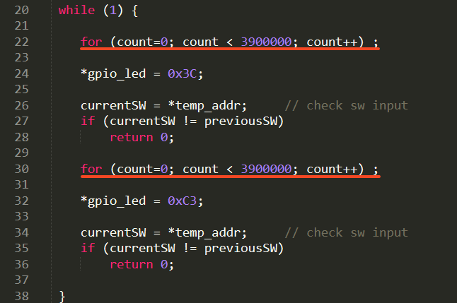

## Goal of this assignment

Show the cache’s impact on performance.

## What did I do?

Wrote a program (either assembly-only or assembly + C), which takes an input from a switch 0 (SW0) on Zedboard and enables caches (L1 and L2) depending on the switch input. If the switch 0 is on, the caches are enabled. If the switch is in the off position, the caches are disabled. When the caches are disabled, the LEDs are blinking with the time interval of 1 second.

## Demo

A demo video can be found [[here](https://trustylin.com/s/Xjtp)] (Click <u>Preview</u> to watch it online)

**This demo is described in Korean, but you can still check out the process of the program running.**

When switch 0 is off, the caches are not activated, and the LEDs blink once every second. When switch 0 is in the on position, the caches are enabled, and the time interval of the `for` loop is greatly reduced, resulting in much faster LEDs blinking.

I wrote two `for` loops in C, which complete one iteration when the value of the `count` == 3,900,000.  The LEDs blink once every time an iteration is completed.

For more detail about how I enable caches in assembly language, see [here](https://github.com/Avafly/Homework-Project/blob/master/ComputerSystemDesign/cache/csd_arm.s).
