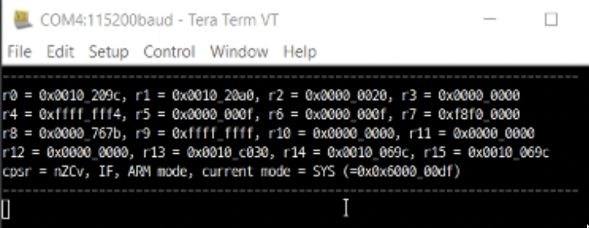

## Goal of this assignment

Write my own debugging macro in ARM assembly. The macro prints out all the registers (R0~R15) and CPSR of the current mode to the UART terminal (Tera Term). So, it can be used for the debugging purpose by inserting it to suspicious places in your assembly code.

## Demo

