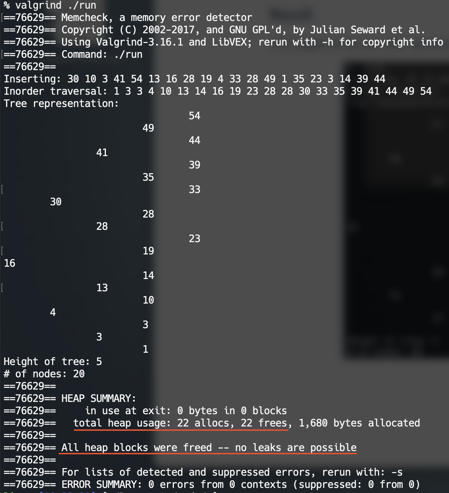

## 📕AVL Tree

An AVL Tree program implemented by C.

The AVL tree is a self-balancing binary search tree. In an AVL tree, the heights of the two child subtrees of any node differ by at most one; if at any time they differ by more than one, rebalancing is done to restore this property.

### Data Structure

```c++
// AVL_TREE type definition
typedef struct node
{
    int            data;
    struct node    *left;
    struct node    *right;
    int            height;
} NODE;

typedef struct
{
    NODE    *root;
    int     count;  // number of nodes
} AVL_TREE;
```

### Result

The heights of the two child subtrees of any node differ by at most one.



