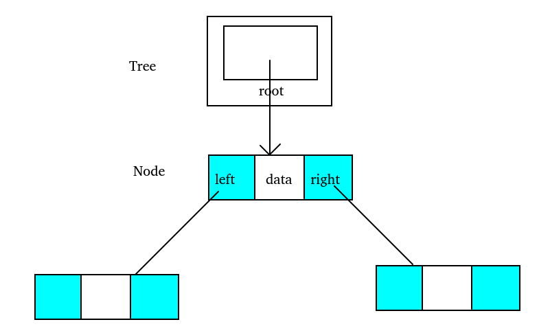
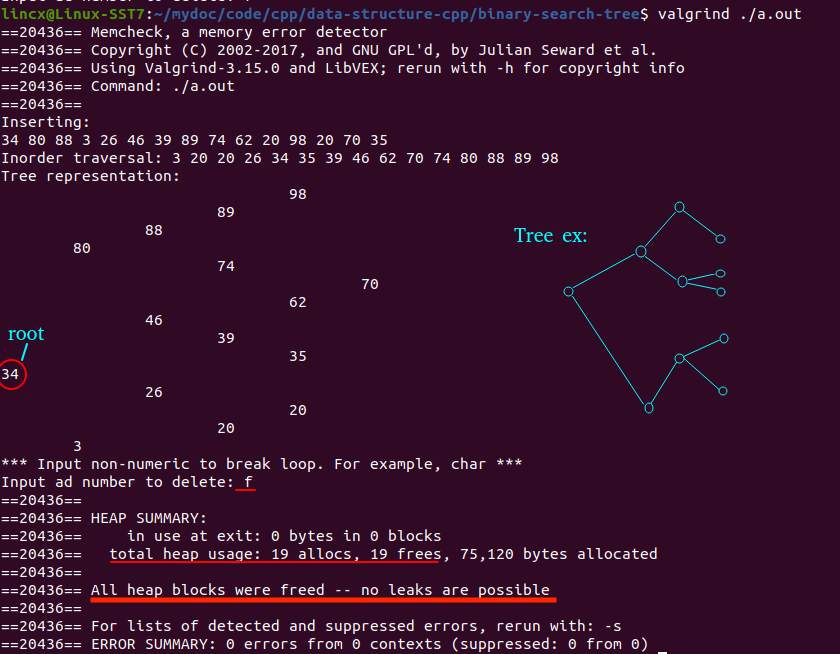

## 📕Binary Search Tree

A simple BST program implemented by C and C++.

The program generates 15 random numbers between 1 and 100, inserts them as nodes into the tree, and then prints the tree.

Next, the program will ask for input: a number to delete a node or a non-number to quit.

The program prints the tree after each update and frees the memory when quits the program.

### Data Structure

```c++
struct Node {
    int data;
    Node* left;
    Node* right;
    Node() : data(0), left(nullptr), right(nullptr) {}
    Node(int data) : data(data), left(nullptr), right(nullptr) {}
};

struct Tree {
    Node* root;
    Tree() : root(nullptr) {}
};
```




### Result

A simple example of printing a tree, quitting by inputting a character, and freeing the memory.



### Function description

```c++
Tree* BST_create();                     // initialize a Tree
void add_BST(Node* &root, int data);    // insert a node
int BST_insert(Tree* pTree, int data);  // insert a node using add_BST()
void _traverse(Node* root);             // output nodes sorted in ascending order
void BST_traverse(Tree* pTree);         // output nodes using add_BST()
void largest_BST(Node* root, Node* &pPre);	// search for the largest node
Node* _delete(Node* root, int data, int &success);  // delete a node
int BST_delete(Tree* pTree, int data);              // delete a node using _delete()
void _destroy(Node* root);              // free the allocated memory
Tree* BST_destroy(Tree* pTree);         // free the allocated memory using _destroy()
void print_tree(Tree* pTree);           // print Tree using _infix_print()
void _infix_print(Node* root, int level);   // print Tree
```

