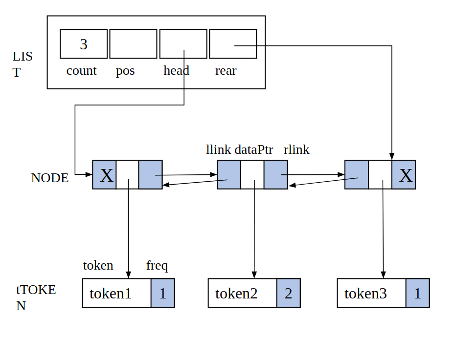
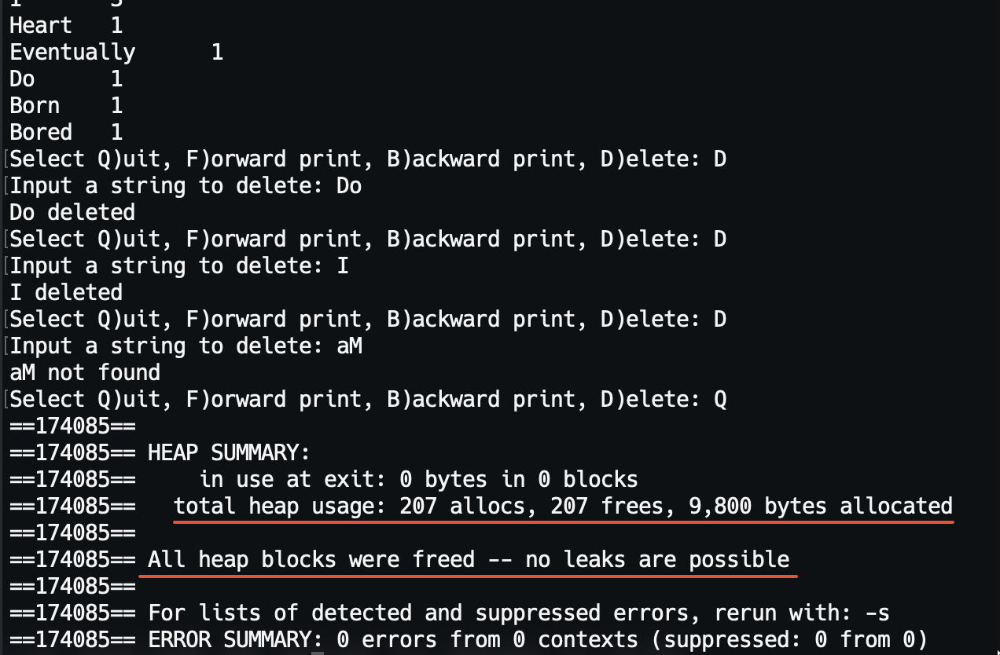

## 📕Double Linked List

A Doubly Linked List program implemented by C.

The program creates a Doubly Linked List with the words in the text as nodes. Each node is linked to the left and right nodes, i.e., the list can be traversed from head to tail node or tail to head node.

The `tTOKEN` structure  stores the string and its count, the `NODE` structure stores the addresses of `tTOKEN` and the left and right nodes, and the `LIST` structure stores the address of the Linked List's head and rear and the count of the nodes.

You can delete the node, print the linked list, or quit. The program frees the memory when deleting a node or quits.

### How to run

`./strdlist text`

### Data Structure

```c++
// User structure type definition
typedef struct
{
    char    *token;
    int     freq;
} tTOKEN;

// LIST type definition
typedef struct node
{
    tTOKEN          *dataPtr;
    struct node     *llink;
    struct node     *rlink;
} NODE;

typedef struct
{
    int    count;
    NODE   *pos;
    NODE   *head;
    NODE   *rear;
} LIST;
```



### Result



