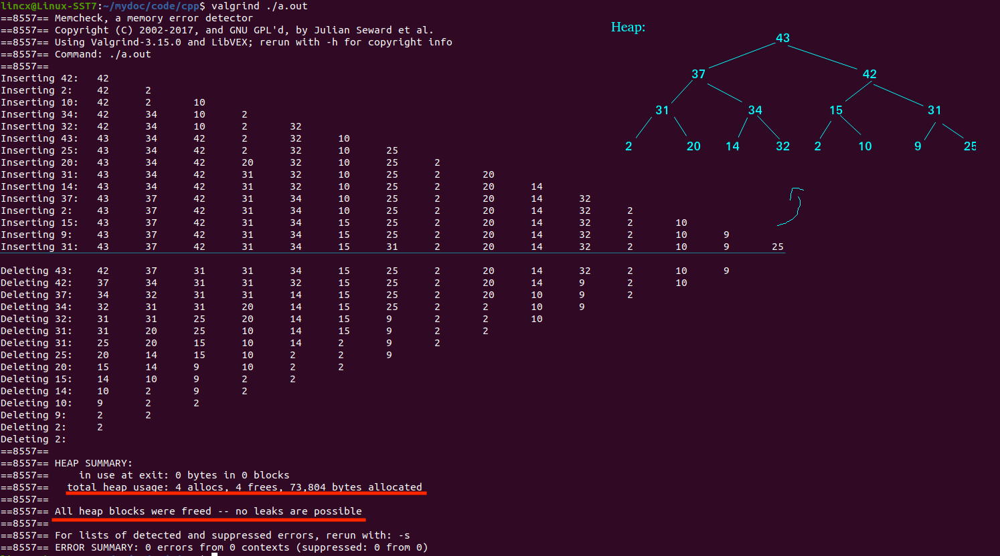

## 📕Heap

A simple Heap program implemented by C and C++.

The program generates 15 random numbers between 1 and 100, inserts them as nodes into the heap, and then prints the heap.

Next, the program iteratively deletes the node.

The program prints the heap after each update and frees the memory when quits the program.

### Data Structure

```c++
struct Heap {
    int* heapArr;
    int last;
    int capacity;
    // constructor
    Heap() : heapArr(new int[MAX_ELEMENT]), last(-1), capacity(0) {}
    // destructor
    ~Heap() {
        if (heapArr != nullptr) {
            delete[] heapArr;
            heapArr = nullptr;
        }
    }
};
```


### Result

