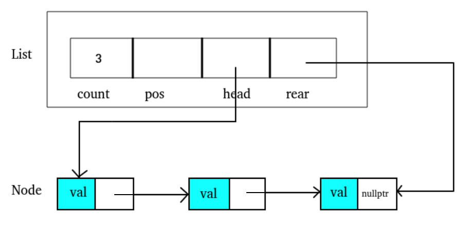
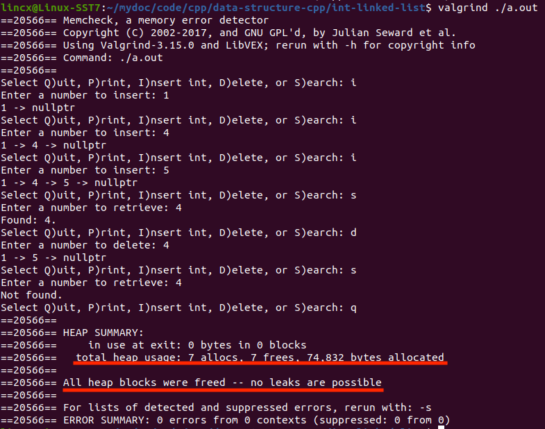

## 📕Linked List

A simple Linked List program implemented by C/C++.


### Data Structure

```c++
struct Node {
    int val;
    Node *next;
    // constructor
    Node() : val(0), next(nullptr) {}
    Node(int x) : val(x), next(nullptr) {}
    Node(int x, Node *next) : val(x), next(next) {}
};

struct List {
    int count;
    Node *pos;
    Node *head;	// first node
    Node *rear;	// last node
    // constructor
    List() : count(0), pos(nullptr), head(nullptr), rear(nullptr) {}
};
```




### Result



### Function description

```c++
int compare(int a, int b);          // compares a and b
List *create_list();                // creates list
List *destroy_list(List *pList);    // destroies the list and free the memory
int list_count(List *pList);        // counts the number of node
bool isEmpty(List *pList);          // returns whether the list is empty
void print_list(List *pList);       // prints the linked list

int add_node(List *pList, int data);                  // adds a node using _insert()
int remove_node(List *pList, int Key, int *dataOut);  // delete a node using _delete()
int search_list(List *pList, int Key, int *dataOut);  // searches a node using _search()
int _insert(List *pList, Node *pPre, int data);       // inserts a node
void _delete(List *pList, Node *pPre, Node *pLoc, int *dataOut);    // deletes node
int _search(List *pList, Node **pPre, Node **pLoc, int argu);       // searches and locate a node
```

