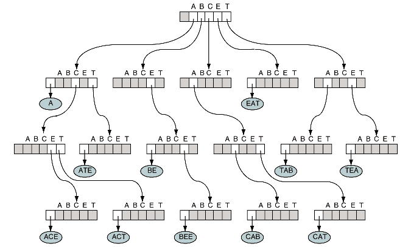
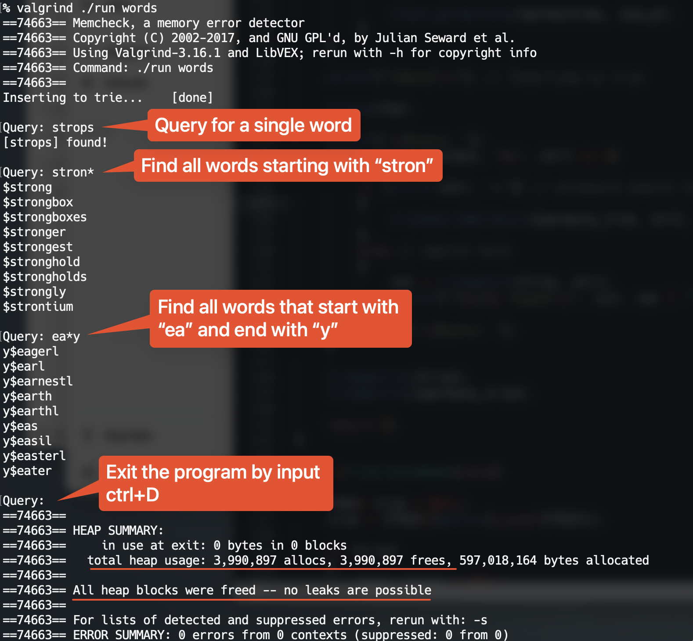

## 📕Trie

A Trie program used to word query implemented by C.

The program reads the words file, and insert the words as nodes.

You can query the word by following syntax.

* Input a word directly, the program returns whether it was found or not.
* Input "ab*", the program returns all words that start with "ab".
* Input "*ab", the program returns all words that end with "ab".
* Input "a*b", the program returns all words that start with "a" and end with "b".

The program frees the memory when deleting a node or quits.

### How to run

`./trie words`

### Data Structure

```c++
// TRIE type definition
typedef struct trieNode {
    char            *entry;
    struct trieNode *subtrees[MAX_DEGREE];
} TRIE;
```



### Result



