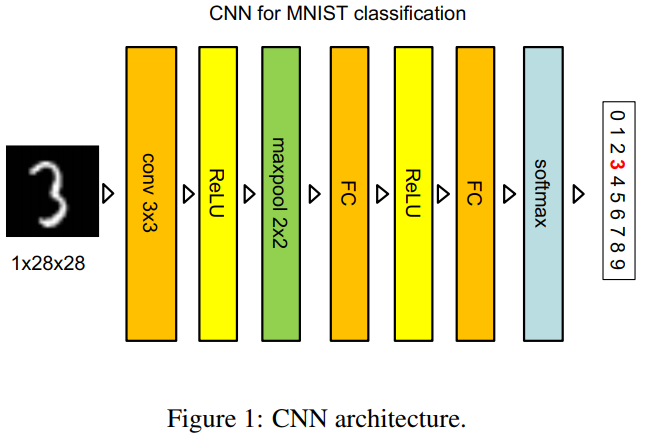
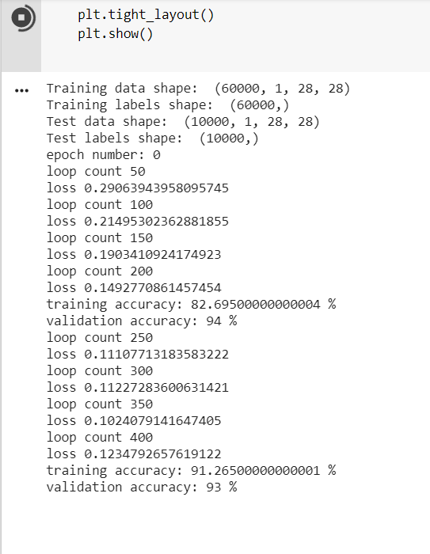
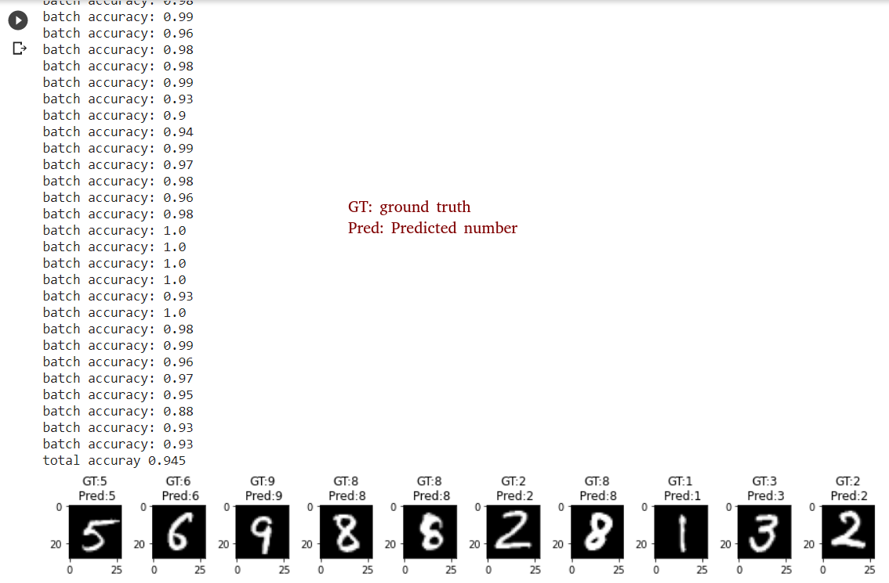

## 📕NumPy CNN

Construct a CNN network using NumPy, and train it using MNIST dataset to recognize digits.

All the components of the CNN network, including forward and backward propagation, Convolutional layer, fully connected layer, pooling layer, and activation function, are implemented using matrix operations.

### How to run

`python3 hw5.py`

### Network architecture

### Dataset

70,000 pixel images (50,000 for training, 10,000 for validation, 10,000 for testing)

### Running results

Show the loss every 50 updates, the training and validation accuracies every 200 updates.

After finishing training, recognize 10 images and show the results.

