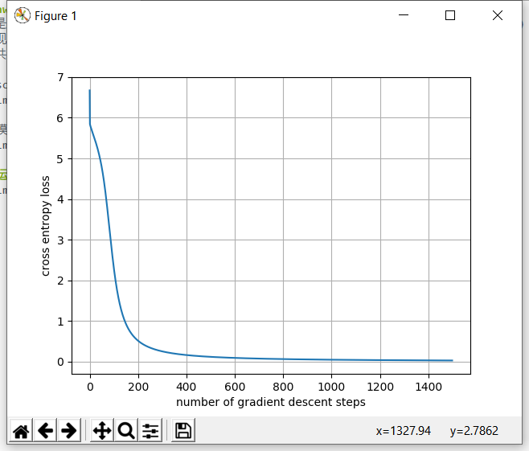

## 📕NumPy CNN

Construct a MLP network using NumPy to implement backpropagation and gradient descent. The goal is to build a neural network, instead of linear classifiers, to classify XOR labels.

### How to run

`python3 hw3.py`

### Network architecture

### Gradients of softmax and cross-entropy functions

### Training loss

### Running results

