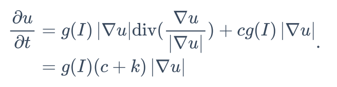
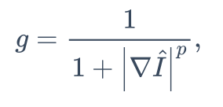
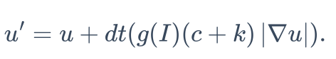
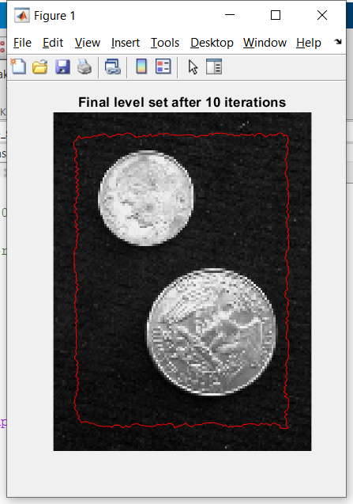
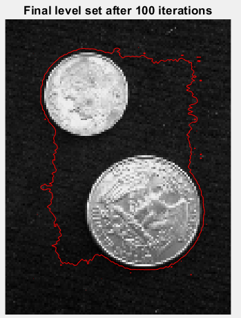
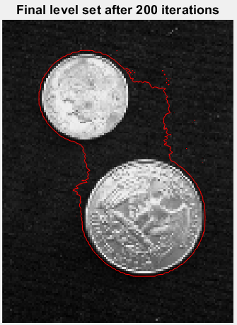
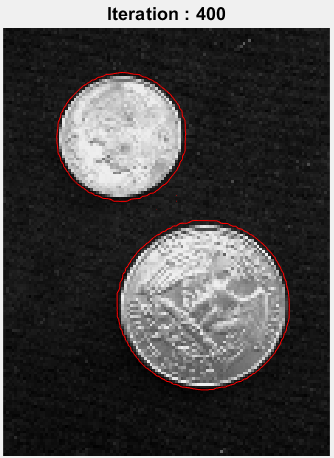
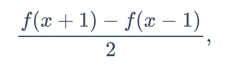
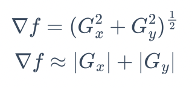
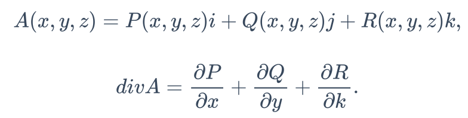

## 📕Level-set Image Segmentation

### Goal of this work

In this assignment, I implemented a level-set image segmentation method on Matlab by using Geodesic Active Contour formulation [[ref](https://link.springer.com/article/10.1023/A:1007979827043)]. Mathematically, the meaning of code can be represented as follows.

In this model, the implicit zero level-set contours is evolving over time, and its update is defined as a time-dependent PDE as follows:



Here, u is the distance field, g is the edge indicator term, c is a constant weight, and k is the curvature term. A commonly used edge indicator term is as follows.



where Î stands for a smoothed version of the input image I, and p=2. This edge indicator works as follows: when the level-set curve is moving closer to edges, then the magnitude of gradient becomes larger and therefore g becomes smaller, which makes the movement of the curve smaller.

The distance of field u can be calculated as follows.




### Content of HW

Implement a level-set image segmentation method to indicate the boundary of each item.

I have to edit the following files:

`assign_3_skeleton.m` drives level-set iteration.

`levelset_update.m` updates level-set.

### What did I do

#### Results

|  |  |
| ------------------------------------------------------------ | ------------------------------------------------------------ |
|  |  |


#### In `assign_3_skeleton.m`

I performed Gaussian smoothing to input image and then compute the gradient and its magnitude.

**Central difference**



**Magnitude of the gradient**




```matlab
% gradient of I
gra_x = zeros(numRows, numCols);   % gradient of x
gra_y = zeros(numRows, numCols);   % gradient of y
temp = zeros(numRows+2, numCols+2);
temp(2:numRows+1, 2:numCols+1) = I;
% central diff.
for i = 2:numRows+1
    for j = 2:numCols+1
        gra_x(i-1, j-1) = (temp(i, j+1) - temp(i, j-1)) / 2;
    end
end
for i = 2:numRows+1
    for j = 2:numCols+1
        gra_y(i-1, j-1) = (temp(i+1, j) - temp(i-1, j)) / 2;
    end
end
gradient_I = sqrt(gra_x.^2 + gra_y.^2);

g = 1 ./ (1+(gradient_I.^p));
```


#### In `levelset_update.m`

Compute ∇u/|∇u|.

```matlab
[dPhi_x, dPhi_y] = gra(phi_in);
dPhi = sqrt(dPhi_x.^2 + dPhi_y.^2 + 1.0e-8.^2);

dPhi_x = dPhi_x ./ dPhi;
dPhi_y = dPhi_y ./ dPhi;
```

Next, compute div(∇u/|∇u|). The divergence formula can be performed as follows.



Therefore, I set `dPhi_x` as P, `dPhi_y` as Q, and calculate div(∇u/|∇u|), as follows.

```matlab
[phix_x, temp] = gra(dPhi_x);
[temp, phiy_y] = gra(dPhi_y);

kappa = (phix_x + phiy_y);
```

In addition, kappa can be represented as second order derivative, and thus it also can be calculated as follows.

```matlab
% use second derivative
% temp = (dPhi_x + dPhi_y) ./ dPhi;
% 
% [a, b] = gra(temp);
% 
% kappa = (a + b);

%dPhi = .....; % mag(grad(phi))

%kappa = .......; % curvature
```

Finally, they are summed to perform Equation (1).

```matlab
smoothness = g.*kappa.*dPhi;
expand = c*g.*dPhi;

phi_out = phi_out + timestep*(expand + smoothness);
```
