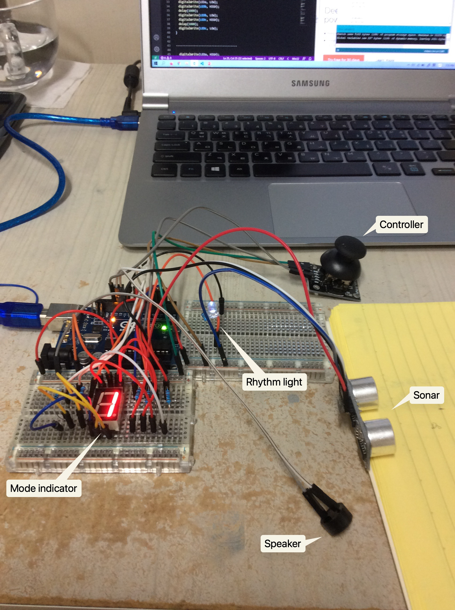

## 📕Sonar Player

### Goal of this work

Develop the prototype of a product using Arduino.

### What did I do

A melody player that can run without touch.

**This product consists of 5 components:**

Controller controls the current mode. There are two modes, which are setting mode and play mode. In setting mode, user can change the sampling frequency and predefined rhythm type; in play mode, our product plays the melody based on the distance between sonar and object.

Rhythm light shines with the current rhythm.

Sonar measures the distance of object (e.g., hand).

Mode indicator displays the rhythm type.

Speaker plays the melody according to the predetermined frequency.

----

There is a [Demo](https://trustylin.com/s/59SB) video and you can watch it online by clicking <u>Preview</u>.

