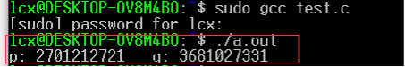
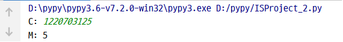
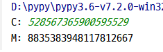
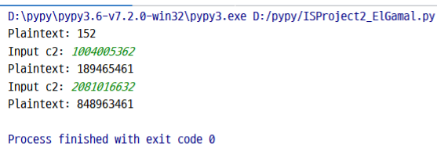

## 📕Information Security Final Project

Decrypt RSA and ElGamal encryptions based on given information.

## Problem 1 - RSA

Decrypt the ciphertext C = 1220703125, which is encrypted using RSA with the following public parameters

- n: 9943237852845877651 (64 bits)
- e: 13 (receiver's public key)

Use the following plaintext and ciphertext to check if the solution is correct.

* Plaintext: 8835383948117812667; Ciphertext: 528567365900595529
* Plaintext: 852845877651; Ciphertext: 8792215503885098117

## Problem 2 - ElGamal

Decrypt the ciphertext c:(c1= 2909170161, c2= 2565161545), which is encrypted using ElGamal with the following public parameters

- q: 2934201397 (GF(2934201397)-32 bits)
- a: 37 (primitive root of q)
- YA: 2174919958 (receiver’s public key)

Use the following plaintext and ciphertext to check if the solution is correct.

* Plaintext: 189465461; Ciphertext : c1 = 2909170161, c2 = 2081016632
* Plaintext: 848963461; Ciphertext : c1 = 2909170161, c2 = 1004005362

## Solutions

### RSA

To decrypt RSA, I have to find parameters `p` and `q` using [find_pq()](https://github.com/Avafly/Homework-Project/tree/master/InformationSecurity/ISProject2_RSA.c) function.

Next, the result can be obtained by [ISProject2_RSA.py](https://github.com/Avafly/Homework-Project/tree/master/InformationSecurity/ISProject2_RSA.py)

Check if the solution is correct

### ElGamal

[Code](https://github.com/Avafly/Homework-Project/tree/master/InformationSecurity/ISProject2_ElGamal.py)

Result

