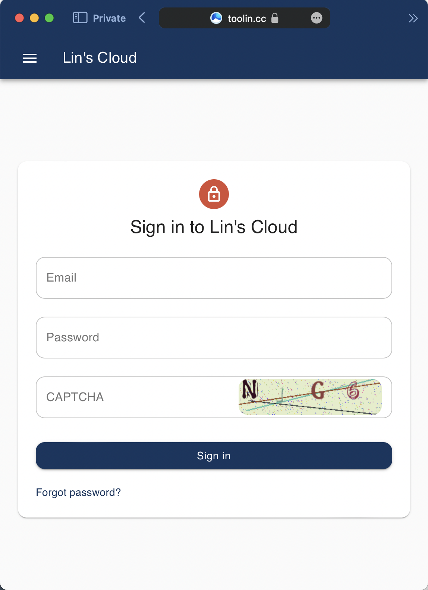
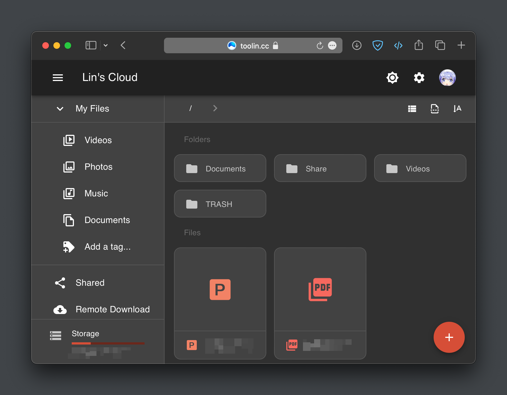
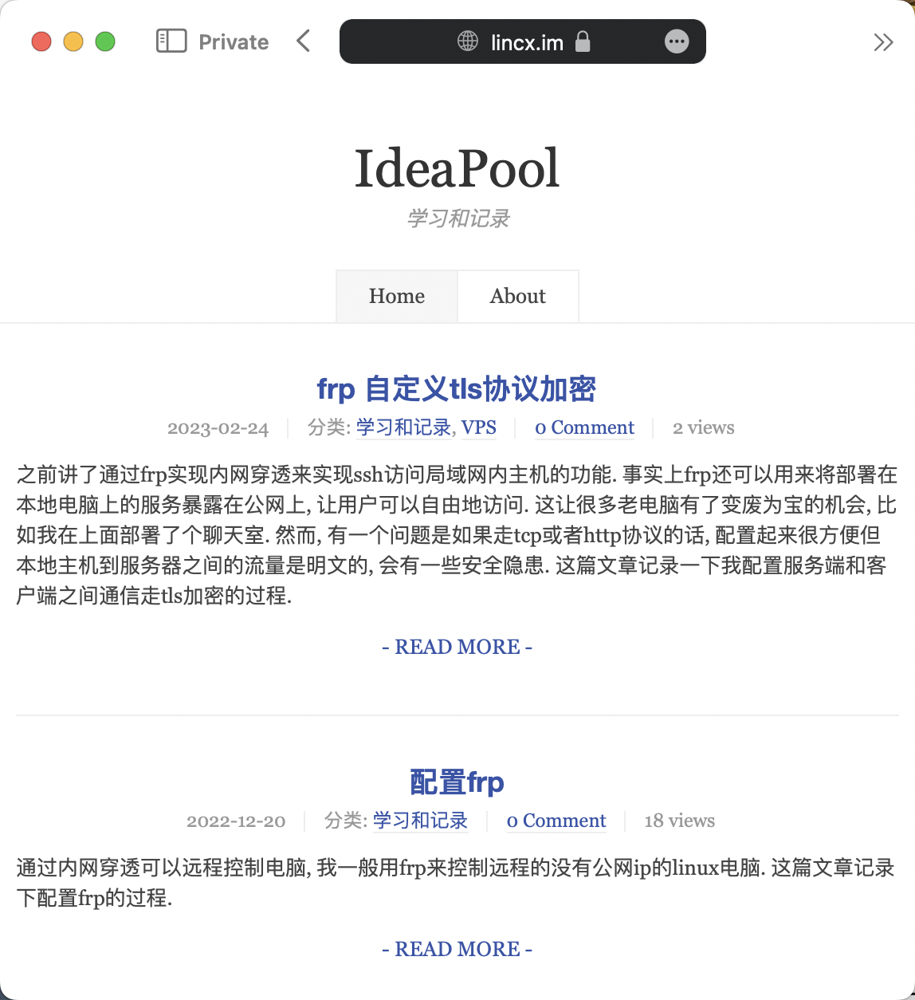
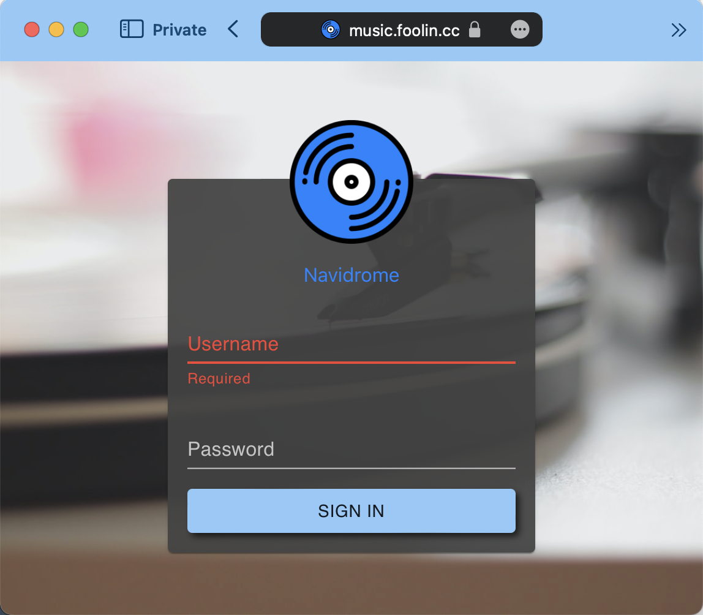
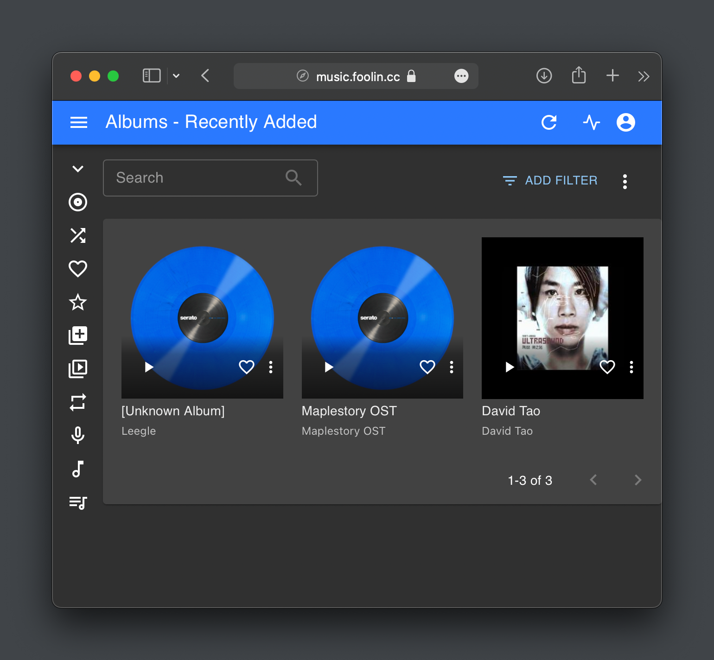
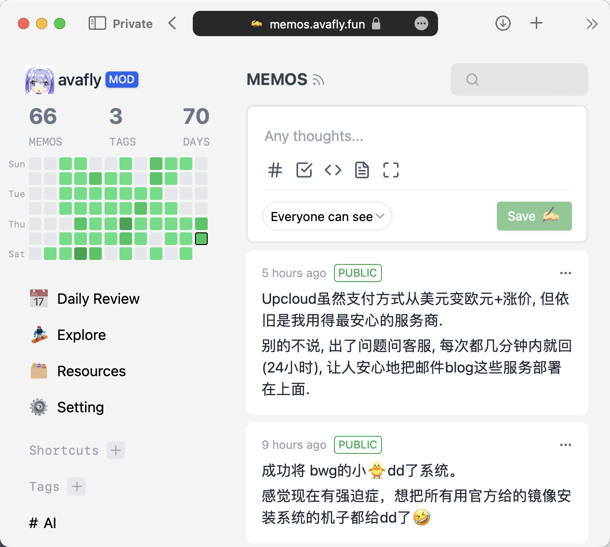
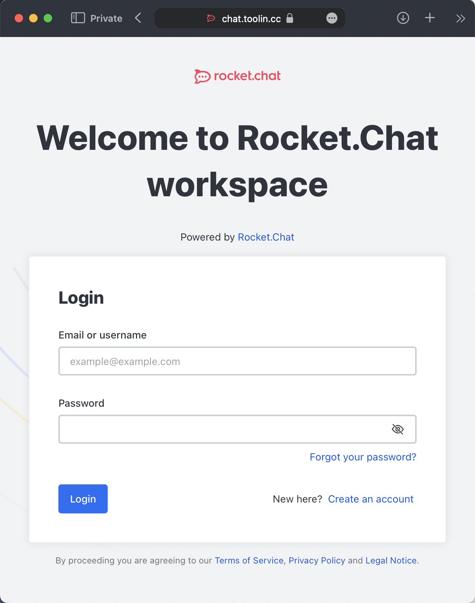
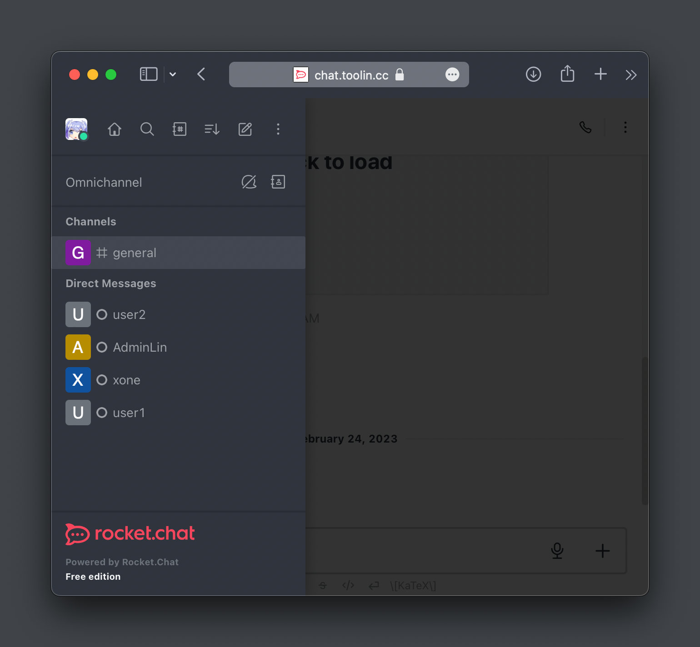
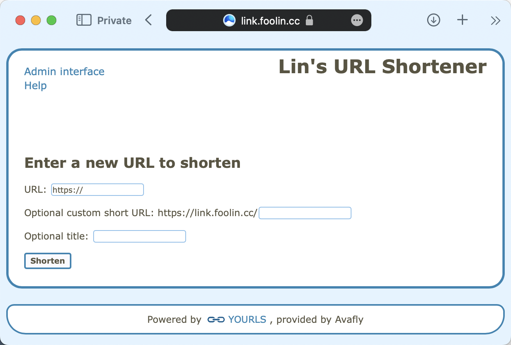

# Linux / Server

This page lists some of the services I deployed on my server, along with a brief description of them.

## Cloudreve

Github: [Link](https://github.com/cloudreve/Cloudreve)

A cloud storage platform. Store and synchronize my files.

## Typecho

Github: [Link](https://github.com/typecho/typecho)

A PHP Blogging Platform. Record some technical content.

## Navidrome

Github: [Link](https://github.com/navidrome/navidrome)

Modern Music Server and Streamer compatible with Subsonic/Airsonic.

A music streaming server. Compatible with Subsonic, and thus it is supported by many client Apps.

## Memos

Github: [Link](https://github.com/usememos/memos)

An open-source, self-hosted memo hub with knowledge management and social networking.

Like a personal Facebook.

## Rocketchat

Github: [Link](https://github.com/RocketChat/Rocket.Chat)

A chatting room for me and my friends.

## Yourls

Github: [Link](https://github.com/YOURLS/YOURLS)

The de facto standard self hosted URL shortener in PHP.

**And a lot other services ...**
