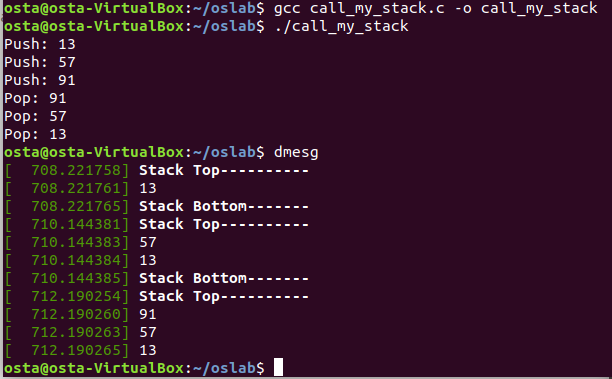
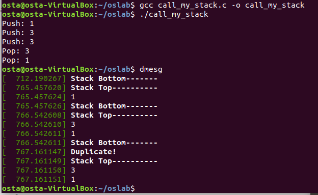

## 📕Assignment 1

Understand and implement the Kernel System Call.

#### Goal of this work

* Modify and compile the Linux source code, and add a new System Call.
* Make a program that uses this System Call.
* Understand how the System Call works.

#### Content of HW

* Add a System Call and make a Stack function that is running in the kernel space.
* Some description
  * The push function only receives int type.
  * The push function ignores the data that is already in the stack.
  * The pop function takes the top data off the stack and prints it.

#### What did I do

I have to edit or make following files for:

* syscalls.h: declare new System Call functions.
* my_stack_syscall.c: source code of my Stack function.
* Makefile: add the `my_stack_syscall.o` object.
* syscall_64.tbl: add info of my System Call functions.
* call_my_stack.c: the Stack program running on user mode.

#### User mode output & Kernel log content

##### Normal case

##### If there is a same data already in the stack, then this input will be ignored.

Source code can be found [[here](https://github.com/Avafly/OperatingSystem-HW/tree/master/hw1/os1_2017320215/os1_2017320215)].

Homework report can be found [[here](https://github.com/Avafly/OperatingSystem-HW/blob/master/hw1/os1_2017320215/report.docx)].
