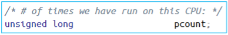

## 📕Assignment 2

This project measures and records the CPU occupation time of the process by using kernel C function on Linux kernel mode to analyzes the process and Linux scheduling.

#### Goals of this work

* Modify the Linux scheduler code.
* Measure and analyze the CPU burst of my system.

#### Content of HW

* Edit the Linux scheduler for measuring CPU burst.
* Measure CPU burst.
* Understand the process and Linux scheduling.

##### What content should be output?

CPU burst info.

#### What did I do

* Analyzed `sched_info_depart()` function in `/kernel/sched/sched.h`.

* Edited the `sched_info_depart()` to output the CPU burst info every 1,000 times per process.

  ```c
  if (t->state == 0 && t->sched_info.pcount % 1000 == 1)
      printk("[Pid: %d], CPUburst: %lld", t->tgid, delta);
  ```

  **Description**

  

  `t` belongs to structure `task_struct`, and `t->state` indicates the running state. Hence, we have to ensure `t->state == 0` first.

  

  `pcount` means the number of times the process has run on CPU, thus we output CPU burst info when `t->sched_info.pcount % 1000 == 1`.

##### Results

* CPU burst measure result & analysis

  **Terminal display**

  

  **Graphic**

  

* Analysis

  The computer played YouTube music on the FireFox browser during the experiment. The burst duration of most of the processes was done in 1 ms, and the longest duration is 44.56 ms. Among them, CPU-bound processes used the most CPU, while I/O-bound processes used less CPU.


For more detail measurement record, see [[here](https://github.com/Avafly/OperatingSystem-HW/blob/master/hw2/os2_2017320215/Project2%20CPU%20burst.xlsx)].